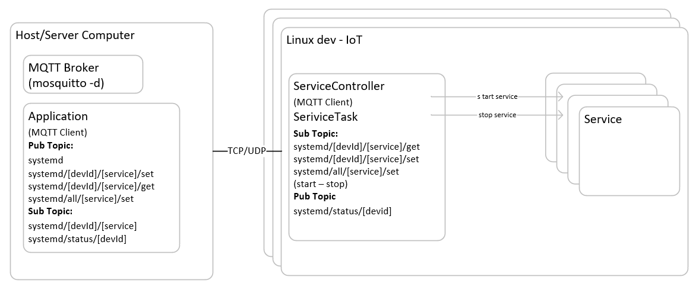
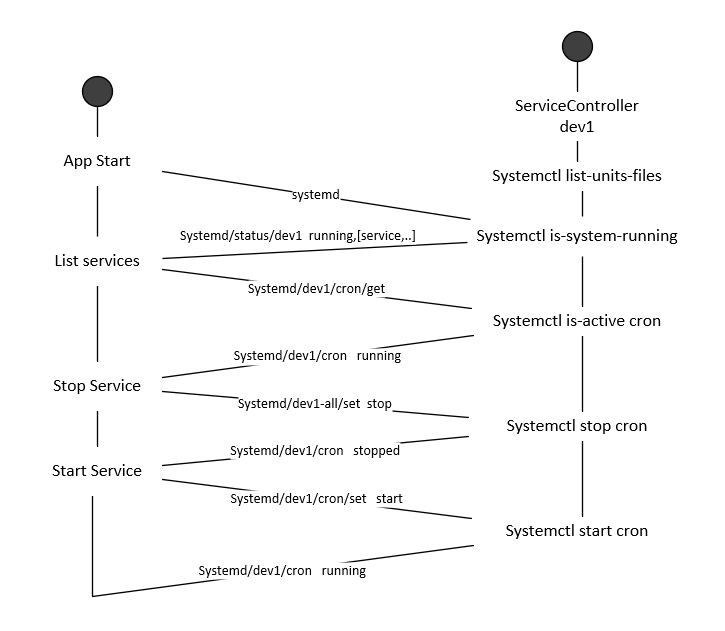

```
# Task

Preamble:
Create a service controller which communicates over MQTT and governs system services.
The task is to create a system service controller which connects to MQTT and starts/stops services posted to a specific topic.

Dependencies:
- A host machine running a service manager (Linux/Unix/Mac OS/Windows)
    - Any operating system will do, as long as you are able to start and stop services
    - Any user is OK (some services require root user. Solving this problem with root access is fine)
    - A Linux operating system with Systemd is preferred
- MQTT Broker
    - The broker is the message handler in the MQTT ecosystem
    - This is also referred to as the MQTT Server
    - This can be any broker, hosted locally or an external one
    - Mosquitto is what we use
- Client libraries of your choice
    - Any library which will allow communication over MQTT
Language:
- Any (scripted or compiled)

Example:

    Command prompt:
        python3 service-controller.py --root-topic="systemd"
   
    MQTT Communication:
        # Topic                     # Payload        # Comment
        systemd/status              online           # Posted by application
        systemd/avahi-daemon/get                     # Incoming message
        systemd/avahi-daemon        running          # Posted by application
        systemd/avahi-daemon/set    stop             # Incoming message
        systemd/avahi-daemon        stopped          # Posted by application
        systemd/foo/get                              # Incoming message
        systemd/foo                 no such service  # Posted by application

```

 <br />  <br /> 

**Task analysis - design**



<br />
<br />

**ServiceController Subscriber Topic syntax**
* systemd
* systemd/[device id]/+/get
* systemd/[device id]/+/set
* systemd/All/+/set


**Application Subscriber Topic syntax**
* systemd/[device id]/+
* systemd/status/#



<br /> <br />

**Setup**

Windows configuration Linux wsl debian distro (enable windows linux subsystem)
```
wsl --update
wsl --install debian
wsl -s debian 
wsl -d debian
```
debian configuration /etc/wsl.conf

```
[boot]
systemd=true
```
exit debian 
```
wsl --shutdown
```
export maching user dbus.
```
ls  /run/user/
1000
export DBUS_SESSION_BUS_ADDRESS=unix:path=/run/user/1000/bus
```
<br /> <br />
**Get dependencies and build**

```
./configure.sh
make
```
**Run programs on debian wsl**
```
./dist/ServiceController
or
python ./ServiceController.py
```
Run Application on Desktop env
```
./dist/Application
or
python ./Application

```


